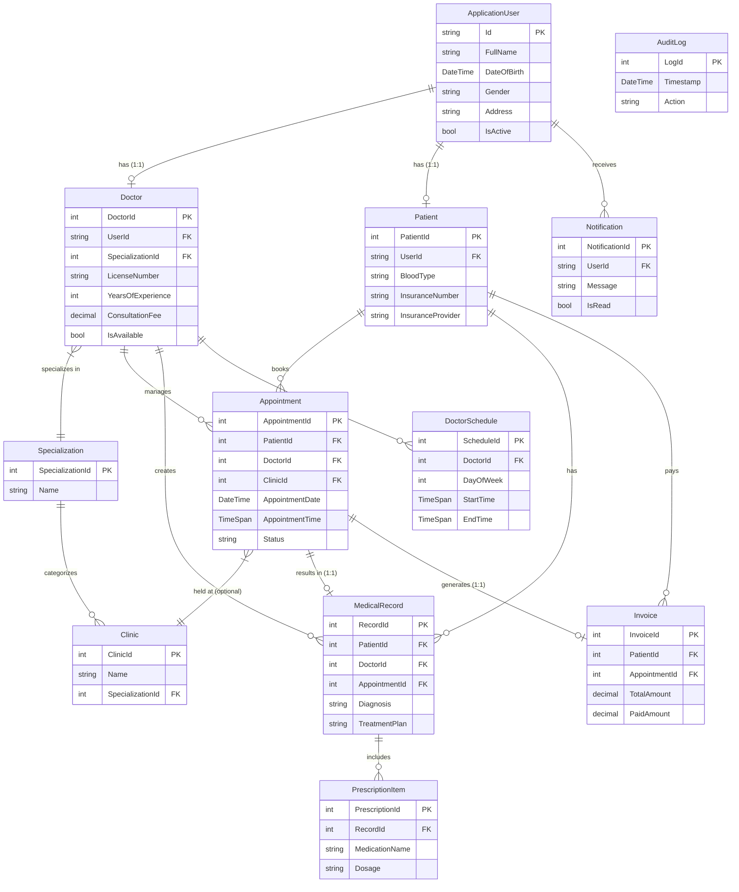

# Hospital Clinic Management System

## About the Project
The Hospital Clinic Management System is a comprehensive, production-ready web application built with ASP.NET Core MVC (.NET 9) designed to streamline the day-to-day operations of modern medical facilities. 

### What Problem It Solves
Managing a clinic involves coordinating multiple moving parts: patient records, doctor schedules, appointment bookings, and billing. Relying on fragmented systems or manual paperwork leads to double-bookings, lost medical histories, and inefficient billing processes. This system centralizes all these operations into a single, unified digital platform, reducing administrative overhead, improving data security, and allowing medical professionals to focus primarily on patient care.

### Key Functions (What It Does)
- **Role-Based Workflows:** Provides secure, tailored dashboards and permissions for Admins, Doctors, Receptionists, and Patients.
- **Appointment Lifecycle Management:** Enables end-to-end booking (with double-booking prevention), scheduling based on doctor availability, and status tracking (Scheduled, Confirmed, Completed, Cancelled).
- **Electronic Medical Records (EMR):** Securely maintains patient medical histories, visit notes, diagnoses, and prescriptions directly tied to their appointments.
- **Automated Billing & Invoicing:** Automatically generates invoices upon appointment completion, tracks payments, and manages billing statuses (Pending, Partially Paid, Paid).
- **Clinic Administration:** Manages doctor specializations, clinic rooms, operating hours, and generates comprehensive analytics and reporting (revenue and appointments).

## Tech Stack

- **Framework**: ASP.NET Core MVC (.NET 9)
- **ORM**: Entity Framework Core 9.0.0 (Code-First)
- **Database**: SQL Server (LocalDB)
- **Authentication**: ASP.NET Core Identity (4 roles)
- **UI**: Bootstrap 5 + Custom CSS Medical Theme
- **Icons**: Bootstrap Icons
- **Charts**: Chart.js
- **Calendar**: FullCalendar.js
- **Tables**: DataTables.js
- **Mapping**: AutoMapper
- **Logging**: Serilog
- **Export**: EPPlus (Excel)
- **Architecture**: MVC + Repository Pattern + Service Layer

## Setup Steps

1. **Prerequisites**: .NET 9 SDK, SQL Server LocalDB
2. **Restore packages**:
   ```bash
   dotnet restore
   ```
3. **Create and apply migration**:
   ```bash
   dotnet ef migrations add InitialCreate
   dotnet ef database update
   ```
4. **Run the application**:
   ```bash
   dotnet run
   ```
5. Navigate to `https://localhost:5001` (or the URL shown in terminal)

## Seeded Login Credentials

| Role         | Email                    | Password       |
|-------------|--------------------------|----------------|
| Admin       | admin@hospital.com       | Admin@123456   |
| Doctor      | doctor1@hospital.com     | Doctor@123456  |
| Receptionist| reception@hospital.com   | Recept@123456  |
| Patient     | patient1@hospital.com    | Patient@123456 |

## Features

### Dashboard
- KPI cards (patients, appointments, doctors, invoices)
- Bar chart (appointments per day)
- Pie chart (appointments by status)
- Today's appointments table

### Doctor Module
- Card view with search and specialization filter
- Full CRUD with soft delete
- Weekly schedule management
- Available time slot calculation

### Patient Module
- Searchable patient list with DataTables
- Full CRUD
- Tabbed profile (info, appointments, records, invoices)
- Patient self-service portal

### Appointment Module
- FullCalendar.js calendar view
- List view with DataTables
- Booking wizard with AJAX (specialization → doctor → slots)
- Status workflow (Scheduled → Confirmed → Completed)
- Double-booking prevention
- 2-hour cancellation rule

### Medical Records
- Create records for completed appointments only
- Dynamic prescription item rows
- File attachment upload
- Print-friendly view

### Invoice & Billing
- Auto-generated invoices on appointment completion
- Payment recording (Cash/Card/Transfer/Insurance)
- Status tracking (Pending/Paid/PartiallyPaid)
- Printable invoice

### Clinic Management
- CRUD for clinic rooms
- Specialization assignment

### Reports
- Appointment report with filters
- Revenue report with filters
- Excel export (EPPlus)

### Notifications
- Bell icon with unread badge
- Dropdown with latest notifications
- Full notification page
- Auto-notification on appointment events

### Security
- ASP.NET Core Identity
- Role-based authorization (Admin, Doctor, Receptionist, Patient)
- Role-based sidebar menu
- Audit logging

## Database Design

12 entities: ApplicationUser, Doctor, Specialization, Patient, Appointment, Clinic, MedicalRecord, PrescriptionItem, Invoice, DoctorSchedule, Notification, AuditLog.



## Seeded Data

- 4 roles
- 1 admin, 1 receptionist, 5 doctors, 20 patients
- 3 specializations, 3 clinics
- Doctor schedules (Mon-Thu, 9AM-5PM)
- 50 appointments across various statuses
- Invoices for completed appointments
